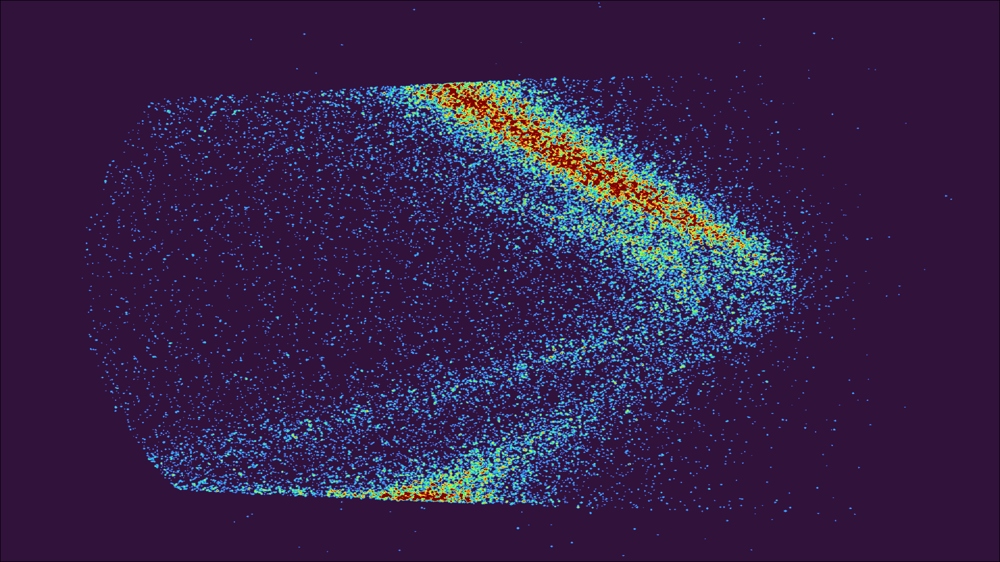

# Photoemission Spectrum Classification

## Repository Link

https://github.com/Torbus2025/photoemission_quality

## Description

The project idea is the pre-evaluation of photoemission spectra. Those come from spatially resolved short time measurements, which are used to determine the best spot for a long term measurement. We want to analyze the quality of the spectrum on a scale of zero to four. In the beginning we will use only one specific material and the goal would be to apply this system to all kinds of materials in the future.

### Task Type

Image Classification

### Results Summary

#### Best Model Performance
- **Best Model:** model_resnet50
- **Evaluation Metric:** precision of the labeling of class 4, accuracy
- **Final Performance:** 85% precision class 4, 87% accuracy

#### Model Comparison
- **Baseline Performance:** 90% precision class 4, 88% accuracy 
- **Improvement Over Baseline:** -5% precision class 4, -1% accuracy
- **Best Alternative Model:** model_resnet18: 75% precision class 4, 83% accuracy 

#### Key Insights
- **Most Important Features:**   - random energy window crop is a very effective method to inhibit overfitting
                                 - lognormalize decreases the effect of hotpixel influence
                                 - resize will be important for future application
                                 - weights of different classes in the CrossEntropyLoss is necessary to compensate the class imbalance
- **Model Strengths:** In contrast to the baseline model, the labeling of a second unrelated dataset is working considerably better. That is why the model can be considered a success even with a slight decrease in the used metrics. 
- **Model Limitations:** The model is only trained on one material and temperature, thus it is only applicable to those datasets for now. The labeling by hand limits the quality of the training data. 
- **Business Impact:** With further training the application in the lab is possible to automatize the selection of the best spot for longterm measurements. 

## Documentation

1. **[Literature Review](0_LiteratureReview/README.md)**
2. **[Dataset Characteristics](1_DatasetCharacteristics/exploratory_data_analysis.ipynb)**
3. **[Baseline Model](2_BaselineModel/baseline_model.ipynb)**
4. **[Model Definition and Evaluation](3_Model/model_definition_evaluation)**
5. **[Presentation](4_Presentation/README.md)**

## Cover Image

